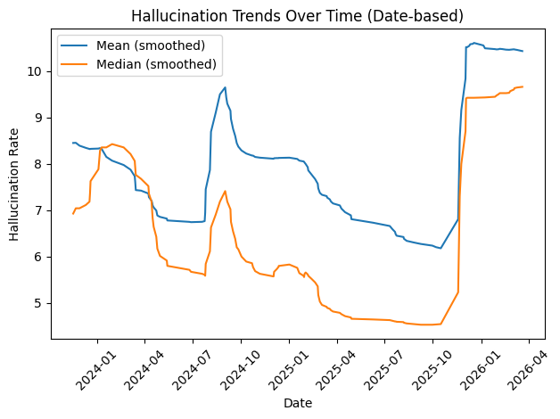
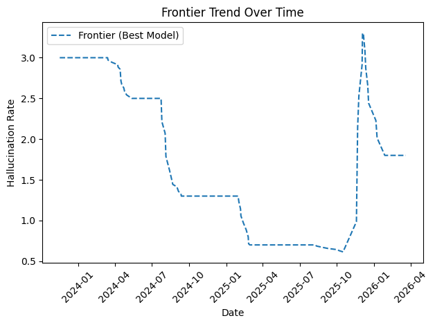
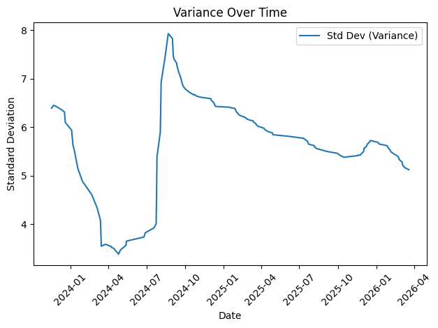

# Longitudinal Analysis of LLM Hallucination Rates  

## Overview

This repository provides a **longitudinal analysis of hallucination rates in Large Language Models (LLMs)** using historical data extracted from the [Vectara Hallucination Leaderboard](https://github.com/vectara/hallucination-leaderboard).

While most research evaluates hallucination at a **single point in time**, this project reconstructs how hallucination behaviour has evolved **over time**, revealing a key finding:

> Hallucination rates do not follow a simple downward trend.  
> Instead, they exhibit a **non-linear trajectory**, including a recent **temporal reversal**.

## Motivation

Despite extensive discussion around hallucinations in LLMs, there is currently:

- No widely available dataset tracking hallucination metrics longitudinally
- Limited understanding of how hallucination behaviour evolves across:
  - model generations  
  - ecosystem expansion  
  - increasing model diversity  

This project addresses that gap by reconstructing a **time series dataset** from the Vectara leaderboard.

## Data Extraction Approach

The Vectara leaderboard is maintained as a Markdown table in the repository README.  
To reconstruct historical trends, we:

### 1. Traverse Git History

We extract all commits affecting `README.md`:

```bash
git log --follow --reverse -- README.md
````

Each commit represents a **snapshot of the leaderboard at a point in time**.

### 2. Extract Leaderboard Tables

For each commit:

* Load the README content
* Parse the Markdown table
* Extract key fields:

  * model
  * hallucination rate
  * factual consistency rate
  * answer rate
  * summary length

### 3. Construct a Time Series Dataset

Each row in the dataset represents:

```(plaintext)
(commit_id, commit_date, model, metrics...)
```

Important characteristics:

* Commit date is used as the time dimension (day-level granularity)
* Models may:

  * appear
  * disappear
  * change performance over time

### 4. Track Model Churn

When a model disappears from a later snapshot:

* It is recorded with `"-"` values
* This allows tracking **ecosystem composition changes**

## Methodological Considerations

This dataset is **not a controlled longitudinal benchmark**.

Key limitations:

* Commit frequency is **irregular**
* Dates are recorded at **day-level resolution**
* The **set of models changes over time**
* Observations reflect **leaderboard state**, not necessarily evaluation date

Therefore:

> This analysis represents **ecosystem-level dynamics**, not fixed-cohort model comparisons.

## Analysis Approach

From the reconstructed dataset, we compute:

### 1. Central Tendency

* Mean hallucination rate
* Median hallucination rate

### 2. Frontier Performance

* Best (lowest) hallucination rate per snapshot

### 3. Variance

* Standard deviation across models

### 4. Smoothing

* Rolling window applied to reduce noise

## Key Findings



Figure 1: Central Tendency of Hallucination Rates Over Time



Figure 2: Frontier (Best Model) Trend



Figure 3: Variance of Hallucination Rates

### 1. Frontier Models Improve (as expected)

* Hallucination rates decrease significantly at the frontier
* Progress occurs in **stepwise improvements**, not continuous decline

### 2. Median Improves Gradually

* The “typical model” shows steady but modest improvement

### 3. Temporal Reversal (Critical Insight)

In late 2025 / early 2026:

* **Mean hallucination rate increases sharply**
* **Variance increases**
* **Median also rises**

This indicates:

> The ecosystem is becoming **more heterogeneous**, not uniformly better

### 4. Ecosystem Dynamics Matter

The results suggest three phases:

| Phase             | Description                                           |
| ----------------- | ----------------------------------------------------- |
| **Improvement**   | Early gains driven by alignment and training advances |
| **Stabilisation** | Convergence across models                             |
| **Divergence**    | Rapid expansion introduces variability                |

## Interpretation

The key takeaway:

> Improvements in state-of-the-art models do **not** translate into uniform ecosystem-wide reliability.

Instead:

* Frontier models → **highly reliable**
* Broader ecosystem → **increasingly variable**

## Implications

This has important consequences:

* Benchmark snapshots can be misleading
* Model selection becomes critical
* Continuous evaluation is required in practice

## Reproducing the Analysis

### Step 1 — Extract the dataset

Run this script within the Vectara cloned repo.

```bash
python tools/extract_history.py
```

This will produce a csv file

### Step 2 — Generate graphs

```bash
python tools/generate_graphs.py data/readme_leaderboard_history.csv
```

## Related Blog Post

(Add link here once published)

## Acknowledgements

- [Vectara Hallucination Leaderboard](https://github.com/vectara/hallucination-leaderboard)
